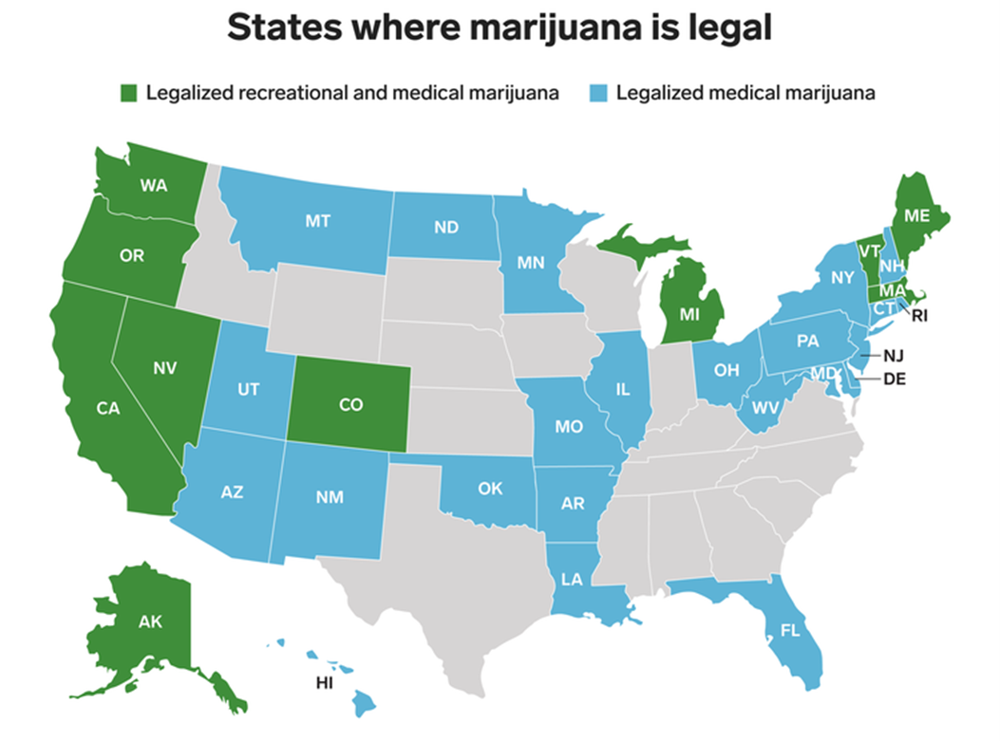
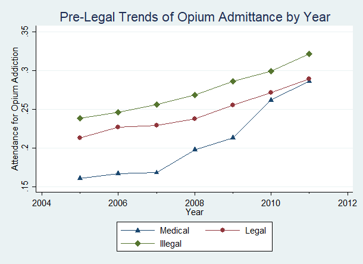
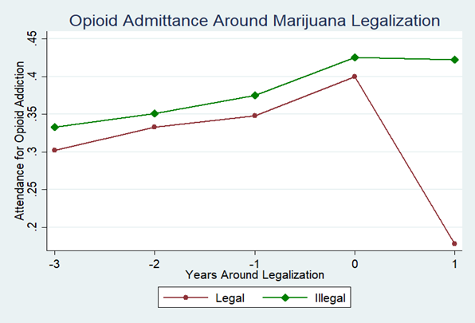

# Purpose

---

This work was done to investigate the causal effect of marijuana legalization on the opioid epidemic. Many states have 
been legalizing, and since this work was originally done in 2019, more states have legalized. 
Below is a map of all the legal states at the time this work was done. 

By utilizing a triple-differences model (a version of difference-in-differences) in combination with TEDS-A data this 
work finds that legalization significantly reduces the rate of admittance for opioid abuse. 

# Data and Models

---

This work used data from the Treatment Episode DataSet -Admissions, or TEDS-A. This is a federally made and maintained dataset
on all treatment facilities that have taken federal funding. Since the money is essentially free as long as the facilities
record information on those admitted (de-individualized) this is free money so nearly all facilities are in this data. 

This work used a difference-in-differences model to garner a causal estimate. This model is reasoned through by the idea
that if there are two areas following the same trends and one has a policy applied to it while the other does not, the 
difference in trends is the causal effect of that policy. To test this assumption a pre-trends is supplied below.

The trends all move similarly and should be enough to get a useful estimate. Additionally, since states all apply marijuana
policies at different times, it is unlikely that there is other legislation that passed at the same time as those bills
that could also cause a mitigating effect. A more thorough defense of the DID assumptions is given in the paper in this
repo. 

# Analysis

This work found that legalizing marijuana led to a statistically significant decrease in opioid abuse. Additionally,
it performed a subsample analysis for the african-american community which demonstrated a larger magnitude drop in 
addiction from medical legalization. These findings are discussed more in depth in the paper. Below is a graph that shows
the drop of admittance for opioid addiction in the year around a state legalizing marijuana. 

# References

1. "33 Legal Medical Marijuana States and DC." Should Marijuana Be a Medical Option? Accessed April 23, 2019. https://medicalmarijuana.procon.org/view.resource.php?resourceID=000881.

2. Berke, Jeremy. "New Jersey Lawmakers Postponed a Critical Vote to Legalize Marijuana - Here Are All the States Where Pot Is Legal." Business Insider. March 26, 2019. Accessed April 23, 2019. https://www.businessinsider.com/legal-marijuana-states-2018-1.

3. National Institute on Drug Abuse. "Overdose Death Rates." NIDA. January 29, 2019. Accessed April 23, 2019. https://www.drugabuse.gov/related-topics/trends-statistics/overdose-death-rates.

4. Quenqua, Douglas. "A Comeback for the Gateway Drug Theory?" The New York Times. December 07, 2017. Accessed May 10, 2019. https://www.nytimes.com/2017/12/07/well/live/a-comeback-for-the-gateway-drug-theory.html.

5. National Institute on Drug Abuse. "Opioid Overdose Crisis." NIDA. January 22, 2019. Accessed April 23, 2019. https://www.drugabuse.gov/drugs-abuse/opioids/opioid-overdose-crisis.

6. Chu, Yu-Wei Luke. "Do Medical Marijuana Laws Increase Hard Drug Use?" SSRN Electronic Journal, 2013. doi:10.2139/ssrn.2283525.

7. Powell, David, Rosalie Liccardo Pacula, and Mireille Jacobson. "Do Medical Marijuana Laws Reduce Addictions and Deaths Related to Pain Killers?" 2016. doi:10.3386/w21345.

8. National Institute on Drug Abuse. "Sex and Gender Differences in Substance Use." NIDA. Accessed May 10, 2019. https://www.drugabuse.gov/publications/research-reports/substance-use-in-women/sex-gender-differences-in-substance-use.

